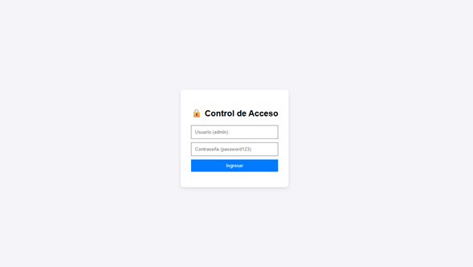
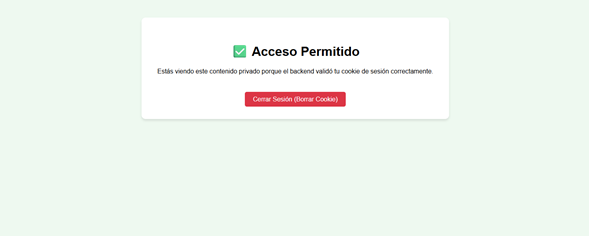
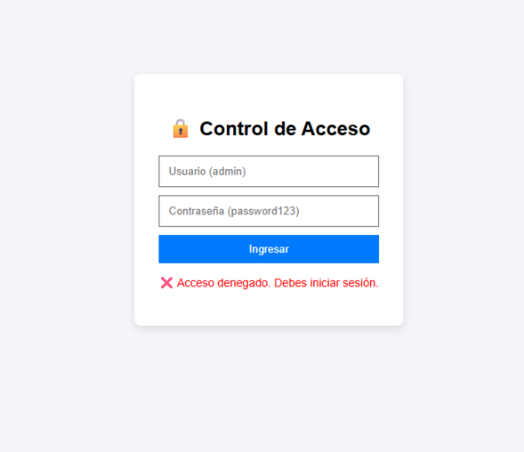
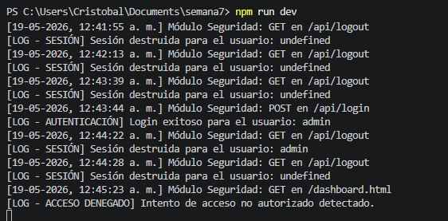

# Actividad 2.3: Elementos de seguridad en desarrollo web con JS 🔒

## 📄 Antecedentes de la Actividad
**Asignatura:** Programación Web 
**Aprendizaje Esperado:** Integrar componentes de JavaScript (JS) con la maqueta web en el entorno backend
**Entorno:** Laboratorio de informática 
---

##  1. Objetivo del Proyecto
El objetivo de este proyecto es implementar una solución mínima utilizando **Node.js** y **Express**  para resolver el problema de control de acceso y persistencia de sesión de usuario en el desarrollo backend. El sistema restringe la visualización de rutas privadas únicamente a peticiones autenticadas y autorizadas mediante cookies seguras, manteniendo una total coherencia visual y funcional con la maqueta base del curso

---

##  2. Arquitectura y Requerimientos Implementados
El desarrollo incorpora de manera integral las directivas solicitadas en la pauta de evaluación:
Manejo de Cookies y Sesión: Configuración del módulo `express-session` con firma criptográfica privada del lado del servidor. La cookie de identificación implementa la propiedad esencial `httpOnly: true` para mitigar ataques de robo de datos mediante inyección de scripts JavaScript del lado del cliente (XSS).
Autenticación Básica: Un endpoint controlado (`POST /api/login`) que intercepta las credenciales enviadas mediante un formulario web y las valida frente a registros de control del servidor
Control de Acceso (Ruta Protegida): Middleware de seguridad `verificarSesion` encargado de filtrar las solicitudes al panel confidencial `dashboard.html`. Si la sesión no es válida, la petición es rechazada e interceptada redirigiendo inmediatamente al flujo de login.
Registro de Eventos (Logs): Middleware global logger encargado de imprimir secuencialmente en la terminal/consola del backend cada evento crítico (intentos fallidos, accesos validados, cierres de sesión) junto con su respectiva marca de tiempo.

---


## EVIDENCIAS

•	Captura del login o punto de acceso.
•	Captura de acceso permitido (usuario autenticado).
•	Captura de acceso denegado (sin sesión o credenciales incorrectas).
•	Captura de consola/log mostrando flujo o eventos relevantes.
##  3. Instrucciones de Instalación y Ejecución

### Prerrequisitos
Tener instalado el entorno de ejecución [Node.js](https://nodejs.org/) localmente.

### Paso 1: Clonar e instalar dependencias
Abre la terminal dentro de la carpeta raíz del proyecto y ejecuta:
```bash
npm install express express-session
npm install --save-dev nodemon